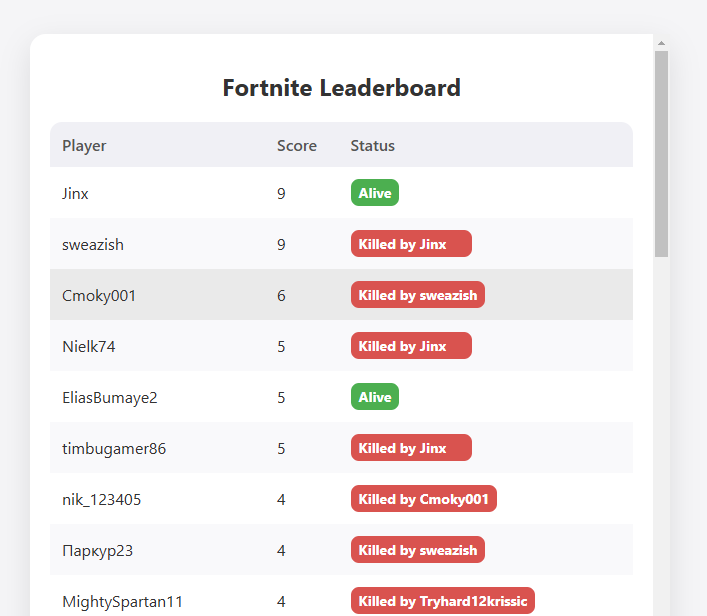

# Fortnite Leaderboard Dashboard

This project provides a real-time leaderboard for Fortnite eliminations by reading from the game’s log file. It displays players' scores, statuses (alive, killed by a specific player, or rebooted), and updates every 2 seconds on a modern HTML dashboard.


## Features

- **Real-time Updates**: Reads the Fortnite log file to capture eliminations, reboots, and new game starts in real time.
- **Leaderboard Display**: Shows each player's score, status, and the player who eliminated them if applicable.
- **Modern Dashboard**: Clean and modern design with a scrollable, responsive leaderboard table.
- **Network Accessibility**: Can be accessed on the local network by setting the server to run on `0.0.0.0`.

## Technologies

- **Python** with Flask: Backend server to parse logs and serve leaderboard data.
- **JavaScript** and **AJAX**: Fetches data every 2 seconds for live updates.
- **HTML** and **CSS**: For a modern, responsive frontend.

## Installation

### Prerequisites


- Python 3.6+
- Fortnite (to generate logs)
- Flask

Install Flask if you haven’t already:

```sh
pip install flask
```

### Setup

You can skip steps 1 to 3 and the prerequisites if you believe in my compiled executable for running the server ('server.exe').

1. Clone the repository or download the code files.

2. Set up the log file path: The log file path is constructed dynamically based on the user's home directory. Ensure that Fortnite is generating logs at the default location:
```python
log_file_path = os.path.join(os.path.expanduser("~"), "AppData", "Local", "FortniteGame", "Saved", "Logs", "FortniteGame.log")
```
3. Run the server:
```sh
python server.py
```
4. Access the Dashboard:

- Open a browser and go to http://127.0.0.1:5000 to view the leaderboard locally.
- For network access, find your local IP and access http://<your_ip>:5000 on any device in the same network.
## Project Structure
```graphql
fortnite-leaderboard/
├── server.py          # Main Python file for log parsing and server
├── server.exe         # Compiled executable for running the server
├── templates/
│   └── index.html     # HTML for the dashboard
└── README.md          # Project documentation
```
## Usage 
- View Leaderboard: Visit the dashboard in your browser to see the leaderboard update in real time.
- Leaderboard Updates: The leaderboard refreshes every 2 seconds and includes:
    - Player eliminations with scores
    - Player reboot status
    - "Killed by [Killer]" for players eliminated by another
    - Reset leaderboard when a new game starts
## Troubleshooting
- Log file not found: Ensure Fortnite is running and logs are being generated at the default path.
- Accessing on local network: Ensure the server is running on 0.0.0.0, and your firewall allows connections on port 5000.

## License
This project is open source and available under the MIT License.

